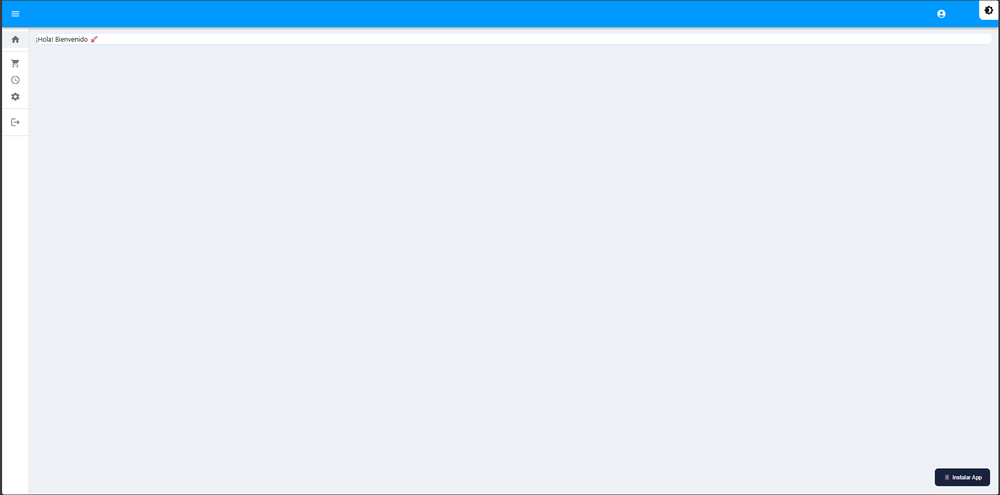
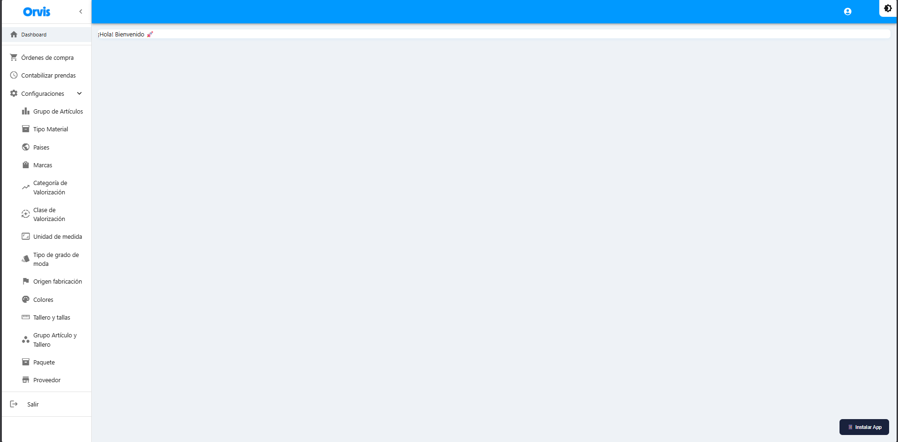

# Pantalla Principal (Dashboard)

#### Pantalla Principal

Al iniciar sesión accederá al Dashboard, la página principal del sistema.

<figure><figcaption></figcaption></figure>


Vista del Dashboard con mensaje de bienvenida


#### Menú de Navegación

El menú lateral izquierdo contiene las siguientes opciones:

| Opción | Descripción |
|--------|-------------|
| **Dashboard** | Página de bienvenida |
| **Órdenes de compra** | Gestión de pedidos |
| **Contabilizar prendas** | Control por cajas |
| **Configuraciones** | Catálogos maestros (desplegable) |
| **Salir** | Cerrar sesión |

<figure><figcaption></figcaption></figure>

#### Expandir/Contraer Menú

* Haga clic en el ícono **<** en la parte superior del menú para contraerlo
* Haga clic en **>** para expandirlo nuevamente

#### Cambiar Tema (Modo Claro/Oscuro)

1. Localice el ícono ⚙️ en la esquina superior derecha
2. Haga clic para alternar entre modo claro y oscuro
3. El cambio se aplicará inmediatamente

#### Cerrar Sesión

1. En el menú lateral, haga clic en **"Salir"**
2. Será redirigido a la pantalla de inicio de sesión
