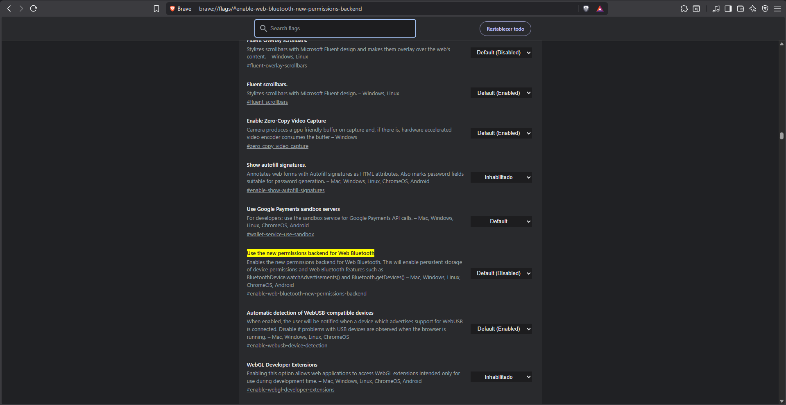

# Impresora Bluetooth

Configuración para impresión de códigos de barras mediante Bluetooth.

## Habilitar Bluetooth en Chrome


Este paso es **obligatorio** para usar la impresión Bluetooth.


1. Abra Google Chrome
2. En la barra de direcciones escriba:
   ```
   chrome://flags/#enable-web-bluetooth-new-permissions-backend
   ```
3. Presione **Enter**
4. Busque la opción y cámbiela a **"Enabled"**
5. Haga clic en **"Relaunch"** para reiniciar el navegador



## Conectar Impresora

1. Encienda su impresora de códigos de barras Bluetooth
2. Asegúrese de que esté en modo de emparejamiento
3. En el sistema, acceda a la función de impresión
4. Haga clic en **"Seleccionar impresora"**
5. El navegador mostrará los dispositivos Bluetooth disponibles
6. Seleccione su impresora de la lista
7. Confirme la conexión


La impresora quedará guardada para futuras impresiones.


## Solución de Problemas

### No aparece el dispositivo

* Verifique que la impresora esté encendida
* Asegúrese de que esté en modo de emparejamiento
* Reinicie el Bluetooth de la impresora
* Actualice la lista de dispositivos

### Error de conexión

* Verifique que habilitó Web Bluetooth en Chrome
* Reinicie el navegador
* Intente desemparejar y emparejar nuevamente

### No imprime

* Verifique que la impresora tenga papel/etiquetas
* Revise el nivel de batería
* Verifique la conexión Bluetooth
