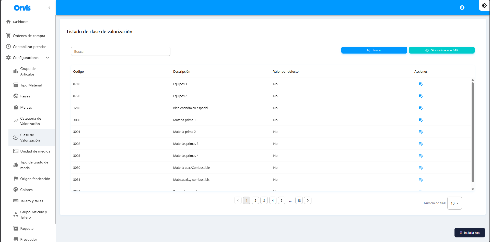

# Clase de Valorización

Catálogo de clases de valorización para los productos.

**Ruta:** Configuraciones → Clase de Valorización

## Operaciones Disponibles

### Buscar
1. Use el campo de búsqueda para filtrar por código o descripción
2. Haga clic en el botón **"Buscar"**
3. La tabla mostrará los resultados

### Sincronizar con SAP
1. Haga clic en **"Sincronizar con SAP"**
2. Confirme la acción en el mensaje emergente
3. Espere a que se complete la sincronización
4. Los datos se actualizarán automáticamente


La sincronización descarga los datos actualizados desde SAP al sistema.


<!-- -->

### Establecer Valor por Defecto
1. Localice el registro deseado en la tabla
2. Haga clic en el ícono **"Aplicar por defecto"** (📋)
3. Confirme la acción


El valor por defecto se seleccionará automáticamente en los formularios de generación de códigos.


| Campo | Descripción |
|-------|-------------|
| Código | Código de la clase |
| Descripción | Nombre de la clase |
| Valor por defecto | Indica si es la clase predeterminada |


La sincronización descarga los datos actualizados desde SAP al sistema.



El valor por defecto se seleccionará automáticamente en los formularios de creación.


