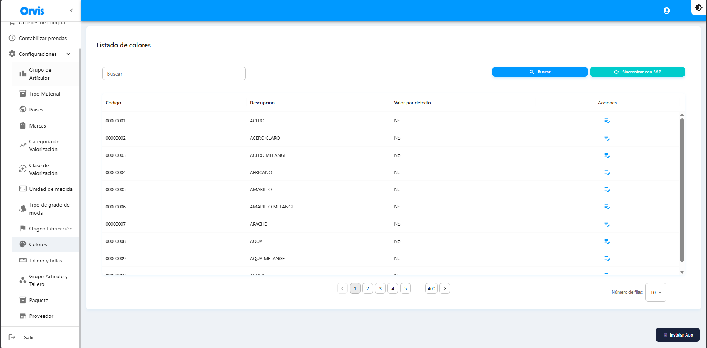

# Colores y Tallas

Configuración de colores, talleros y relaciones con grupos de artículos.

---

## Colores

Catálogo de colores disponibles para los productos.


**Ruta:** Configuraciones → Colores


<figure><figcaption></figcaption></figure>

| Campo | Descripción |
|-------|-------------|
| Código | Código único del color |
| Descripción | Nombre del color |
| Valor por defecto | Indica si es el color predeterminado |

**Operaciones disponibles:**
* Buscar colores
* Sincronizar con SAP
* Establecer valor por defecto

***

## Tallero y Tallas

Gestión de talleros (conjuntos de tallas) y sus tallas asociadas.


**Ruta:** Configuraciones → Tallero y tallas


<figure><figcaption></figcaption></figure>

| Campo | Descripción |
|-------|-------------|
| Código SAP Tallero | Código único del tallero |
| Marca asociada | Marca vinculada |
| Tallas | Lista de tallas del tallero |


Cada tallero agrupa un conjunto de tallas específico. Por ejemplo: XS, S, M, L, XL para adultos o 2, 4, 6, 8 para niños.


***

## Grupo Artículo y Tallero

Configuración de la relación entre grupos de artículos y talleros.


**Ruta:** Configuraciones → Grupo Artículo y Tallero


| Campo | Descripción |
|-------|-------------|
| Grupo artículo nivel 4 | Línea del producto |
| Grupo artículo nivel 5 | Sublínea del producto |
| Tallero asociado | Tallero vinculado |

**Crear Relación**

1. Haga clic en **"Nuevo"**
2. Seleccione el Grupo artículo nivel 4
3. Seleccione el Grupo artículo nivel 5
4. Seleccione el Tallero correspondiente
5. Haga clic en **"Guardar"**


Esta configuración determina qué tallero se muestra automáticamente al generar códigos para un grupo de artículo específico.

