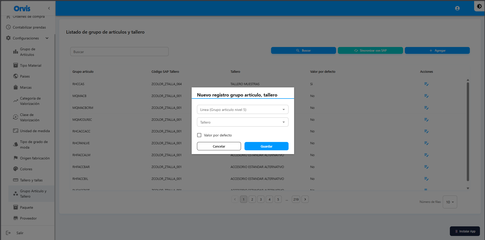
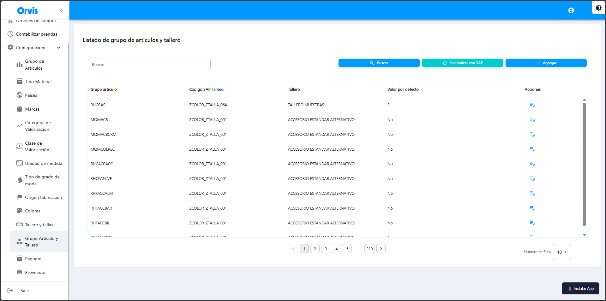

# Grupo Artículo y Tallero

Configuración de la relación entre grupos de artículos y talleros.

**Ruta:** Configuraciones → Grupo Artículo y Tallero

## Operaciones Disponibles

### Buscar
1. Use el campo de búsqueda para filtrar por Grupo artículo, Código SAP Tallero y Tallero
2. Haga clic en el botón **"Buscar"**
3. La tabla mostrará los resultados

### Sincronizar con SAP
1. Haga clic en **"Sincronizar con SAP"**
2. Confirme la acción en el mensaje emergente
3. Espere a que se complete la sincronización
4. Los datos se actualizarán automáticamente


La sincronización descarga los datos actualizados desde SAP al sistema.


<!-- -->

### Crear Nuevo
1. Haga clic en **"Nuevo"**
2. Complete el formulario
3. Haga clic en **"Guardar"**

### Editar
1. Haga clic en el ícono de edición (✏️)
2. Modifique los campos necesarios
3. Haga clic en **"Actualizar"**


Solo se pueden editar los registros creados manualmente.


<!-- -->

## Formulario de Creación

## Campos

| Campo | Descripción |
|-------|-------------|
| Grupo artículo | Grupo de artículo de nivel 5 (Linea) |
| Código SAP Tallero | Código del grupo de artículo asociado proveniente de SAP (se asigna automáticamente al seleccionar el grupo de artículo) |
| Tallero | Tallero a asociar con el grupo de artículo |
| Tallas | Lista de tallas disponibles en el tallero seleccionado (solo visualización) |
| Establecer como predeterminado | Marque esta opción si desea que este tallero sea el predeterminado para el grupo de artículo |


Esta configuración determina qué tallero se muestra automáticamente al generar códigos para un grupo de artículo específico.


<!-- -->

