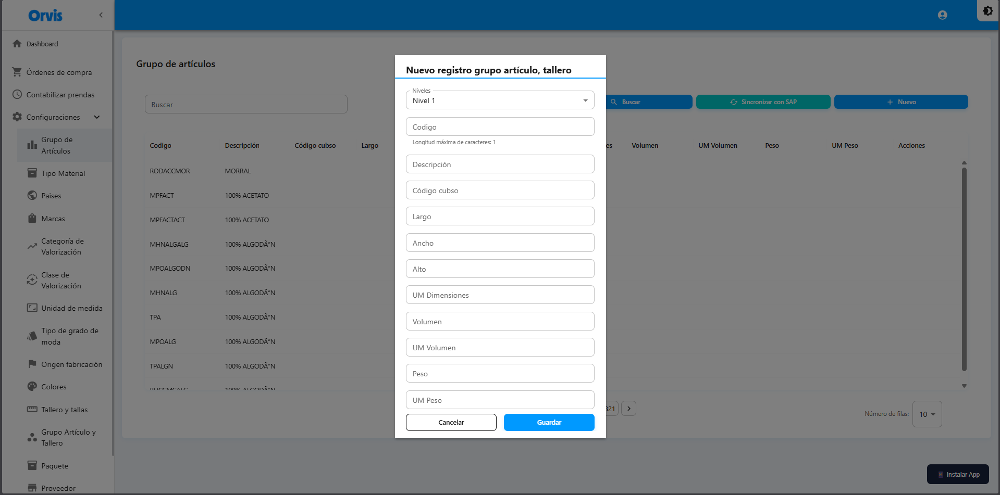
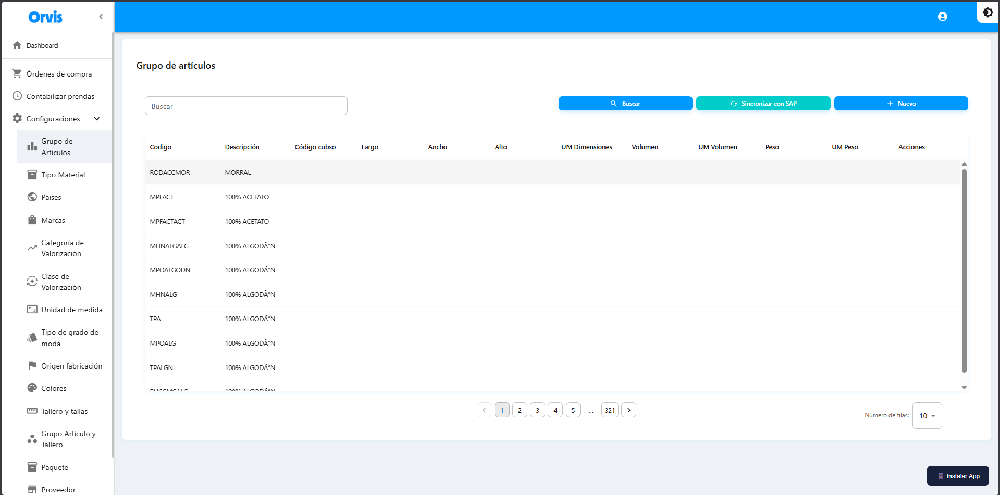

# Grupo de Artículos

Gestiona la jerarquía de productos organizada en 5 niveles.

**Ruta:** Configuraciones → Grupo de Artículos

## Operaciones Disponibles

### Buscar
- Use el campo de búsqueda para filtrar por código o descripción
- La tabla se actualiza automáticamente

### Sincronizar con SAP
- Haga clic en **"Sincronizar con SAP"**
- Confirme la acción
- Se descargarán los datos actualizados desde SAP


La sincronización descarga los datos actualizados desde SAP al sistema.


<!-- -->

### Crear Nuevo
1. Haga clic en **"Nuevo"**
2. Complete el formulario
3. Haga clic en **"Guardar"**

### Editar
1. Haga clic en el ícono de edición (✏️)
2. Modifique los campos necesarios
3. Haga clic en **"Guardar"**


Solo se pueden editar los registros creados manualmente.


<!-- -->

### Eliminar
1. Haga clic en el ícono de eliminar (🗑️)
2. Confirme la acción


Solo se pueden eliminar los registros creados manualmente.


<!-- -->

## Formulario de Creación

## Campos

| Campo | Descripción |
|-------|-------------|
| Niveles | Seleccione la jerarquía de 5 niveles (Categoría → Subcategoría → División → Línea → Sublínea) |
| Código cubo | Identificador único del artículo |
| Largo | Dimensión de largo |
| Ancho | Dimensión de ancho |
| Alto | Dimensión de alto |
| UM Dimensiones | Unidad de medida para dimensiones |
| Volumen | Volumen del artículo |
| UM Volumen | Unidad de medida para volumen |
| Peso | Peso del artículo |
| UM Peso | Unidad de medida para peso |

## Jerarquía de Niveles

La estructura jerárquica de clasificación de productos tiene 5 niveles:

* **Nivel 1**: Categoría principal
* **Nivel 2**: Subcategoría
* **Nivel 3**: División
* **Nivel 4**: Línea
* **Nivel 5**: Sublínea


Los niveles se usan en la generación de códigos para clasificar los productos.

