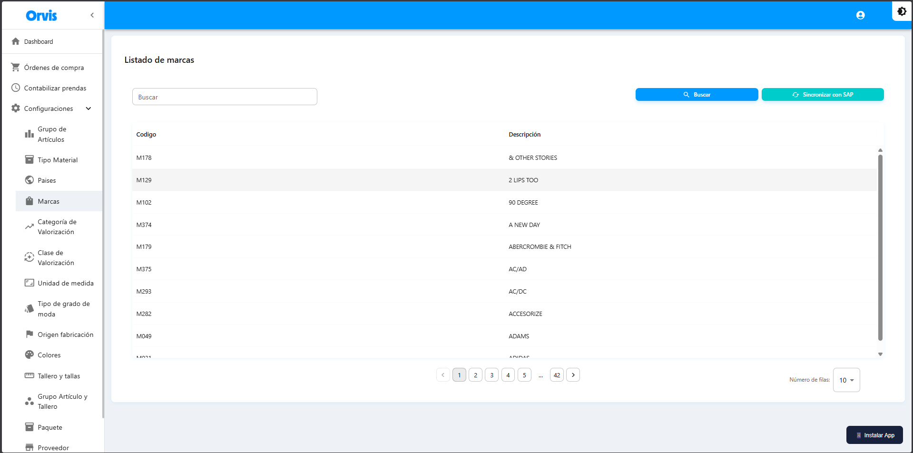

# Marcas

Catálogo de marcas comerciales disponibles para los productos.

**Ruta:** Configuraciones → Marcas

## Operaciones Disponibles

### Buscar
1. Use el campo de búsqueda para filtrar por código o descripción
2. Haga clic en el botón **"Buscar"**
3. La tabla mostrará los resultados

### Sincronizar con SAP
1. Haga clic en **"Sincronizar con SAP"**
2. Confirme la acción en el mensaje emergente
3. Espere a que se complete la sincronización
4. Los datos se actualizarán automáticamente


La sincronización descarga los datos actualizados desde SAP al sistema. Este catálogo es de solo lectura y se administra desde SAP.


<!-- -->

| Campo | Descripción |
|-------|-------------|
| Código | Código de la marca |
| Descripción | Nombre de la marca |


La sincronización descarga los datos actualizados desde SAP al sistema.


