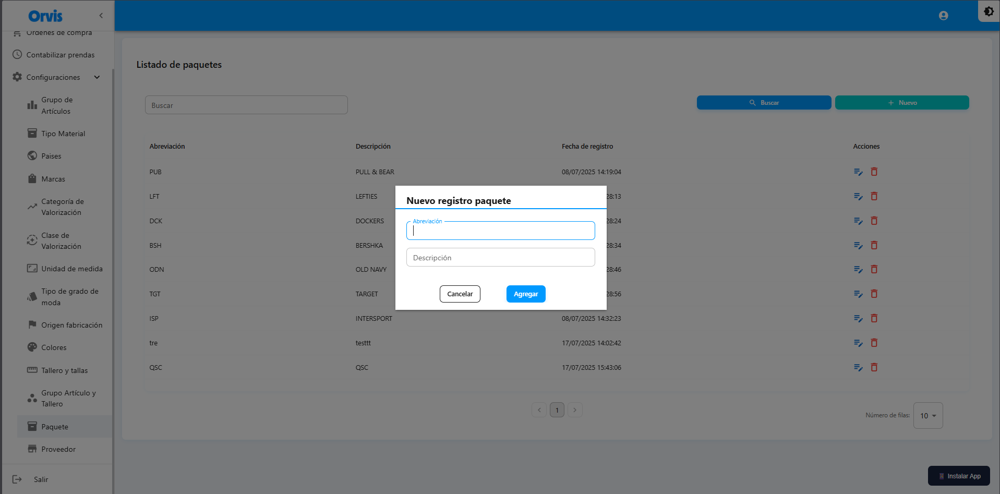
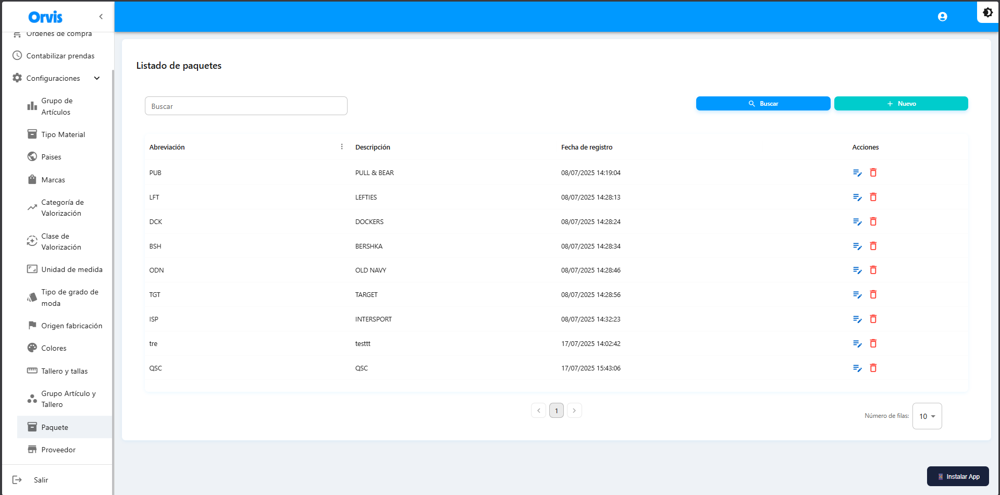

# Paquete

Catálogo de tipos de paquetes disponibles para los productos.

**Ruta:** Configuraciones → Paquete

## Operaciones Disponibles

### Buscar
1. Use el campo de búsqueda para filtrar por código o descripción
2. Haga clic en el botón **"Buscar"**
3. La tabla mostrará los resultados

### Crear Nuevo
1. Haga clic en **"Nuevo"**
2. Complete el formulario
3. Haga clic en **"Guardar"**

### Editar
1. Haga clic en el ícono de edición (✏️)
2. Modifique los campos necesarios
3. Haga clic en **"Actualizar"**

### Eliminar
1. Haga clic en el ícono de eliminar (🗑️)
2. Confirme la acción


Esta acción eliminará permanentemente el registro.


<!-- -->

## Formulario de Creación

## Campos

| Campo | Descripción |
|-------|-------------|
| Abreviatura | Código o abreviatura del paquete |
| Descripción | Nombre descriptivo del paquete |
| Fecha de registro | Fecha y hora de creación del registro (se asigna automáticamente) |

