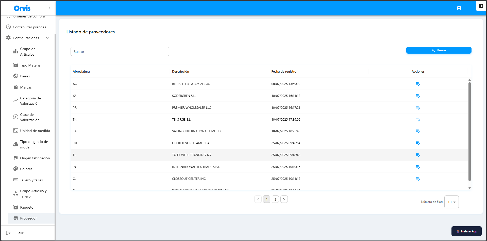

# Proveedor

Catálogo de proveedores disponibles para los productos.

**Ruta:** Configuraciones → Proveedor

## Operaciones Disponibles

### Buscar
1. Use el campo de búsqueda para filtrar por abreviatura o descripción
2. Haga clic en el botón **"Buscar"**
3. La tabla mostrará los resultados

### Editar
1. Haga clic en el ícono de edición (✏️)
2. Modifique los campos necesarios
3. Haga clic en **"Actualizar"**


Los proveedores son registros importados del sistema. Solo se pueden editar campos específicos.


<!-- -->

## Formulario de Edición

## Campos

| Campo | Descripción |
|-------|-------------|
| Abreviatura | Abreviatura o código corto del proveedor |
| Descripción | Nombre descriptivo del proveedor |
| Fecha de registro | Fecha y hora de creación del registro (se muestra en la tabla) |

