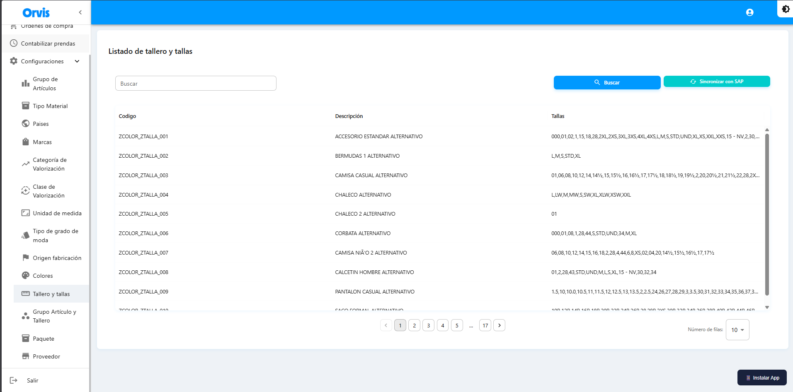

# Tallero y Tallas

Gestión de talleros (conjuntos de tallas) y sus tallas asociadas.

**Ruta:** Configuraciones → Tallero y Tallas

## Operaciones Disponibles

### Buscar
1. Use el campo de búsqueda para filtrar por código o descripción
2. Haga clic en el botón **"Buscar"**
3. La tabla mostrará los resultados

### Sincronizar con SAP
1. Haga clic en **"Sincronizar con SAP"**
2. Confirme la acción en el mensaje emergente
3. Espere a que se complete la sincronización
4. Los datos se actualizarán automáticamente


La sincronización descarga los datos actualizados desde SAP al sistema, incluyendo los talleros y sus tallas asociadas.


<!-- -->

### Editar
1. Localice el registro en la tabla
2. Haga clic en el ícono de edición (✏️)
3. Modifique los campos necesarios
4. Haga clic en **"Guardar"**


**Restricción:** Solo se pueden editar los registros creados manualmente. Los registros sincronizados desde SAP no se pueden modificar.


| Campo | Descripción |
|-------|-------------|
| Código SAP Tallero | Código único del tallero |
| Marca asociada | Marca vinculada |
| Tallas | Lista de tallas del tallero |


La sincronización descarga los datos actualizados desde SAP al sistema.



El valor por defecto se seleccionará automáticamente en los formularios de creación.


