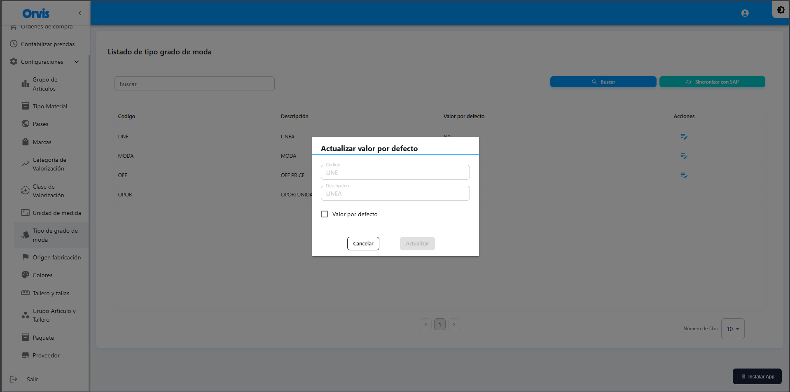

# Tipo de Grado de Moda

Catálogo de tipos de grado de moda para los productos.

**Ruta:** Configuraciones → Tipo de Grado de Moda

## Operaciones Disponibles

### Buscar
1. Use el campo de búsqueda para filtrar por código o descripción
2. Haga clic en el botón **"Buscar"**
3. La tabla mostrará los resultados

### Sincronizar con SAP
1. Haga clic en **"Sincronizar con SAP"**
2. Confirme la acción en el mensaje emergente
3. Espere a que se complete la sincronización
4. Los datos se actualizarán automáticamente


La sincronización descarga los datos actualizados desde SAP al sistema.

<!-- -->

### Editar
1. Localice el registro en la tabla
2. Haga clic en el ícono de edición (✏️)
3. Modifique el campo disponible

| Campo | Descripción |
|-------|-------------|
| Valor por defecto | Marca o desmarca si este material es el predeterminado |

4. Haga clic en **"Actualizar"**


Solo se puede editar el campo **"Valor por defecto"**. Los campos Código y Descripción son de solo lectura ya que provienen de SAP.

<!-- -->

### Campos

| Campo | Descripción |
|-------|-------------|
| Código | Código del grado de moda |
| Descripción | Nombre del grado de moda |
| Valor por defecto | Indica si es el grado predeterminado |


La sincronización descarga los datos actualizados desde SAP al sistema.



El valor por defecto se seleccionará automáticamente en los formularios de creación.


