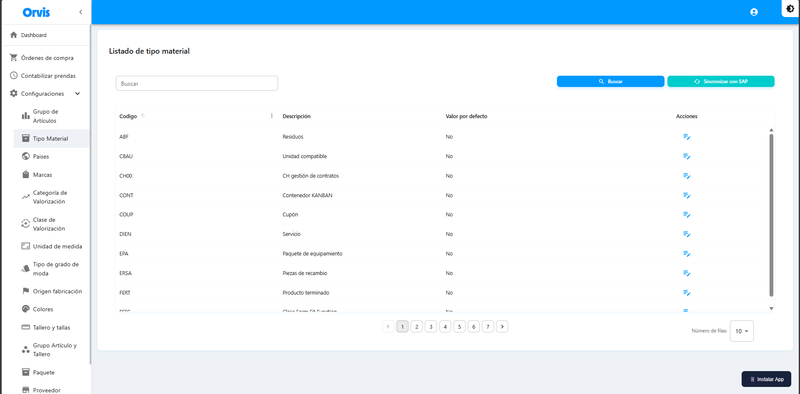

# Tipo Material

Catálogo de tipos de materiales disponibles para los productos.

**Ruta:** Configuraciones → Tipo Material

## Operaciones Disponibles

### Buscar
- Use el campo de búsqueda para filtrar por código o descripción
- La tabla se actualiza automáticamente

### Sincronizar con SAP
1. Haga clic en **"Sincronizar con SAP"**
2. Confirme la acción en el mensaje emergente
3. Espere a que se complete la sincronización
4. Los datos se actualizarán automáticamente


La sincronización descarga los datos actualizados desde SAP al sistema. Este catálogo es de solo lectura y se administra desde SAP.


<!-- -->

| Campo | Descripción |
|-------|-------------|
| Código | Código único del material |
| Descripción | Nombre del material |
| Valor por defecto | Indica si es el material predeterminado |


La sincronización descarga los datos actualizados desde SAP al sistema.



El valor por defecto se seleccionará automáticamente en los formularios de creación.


