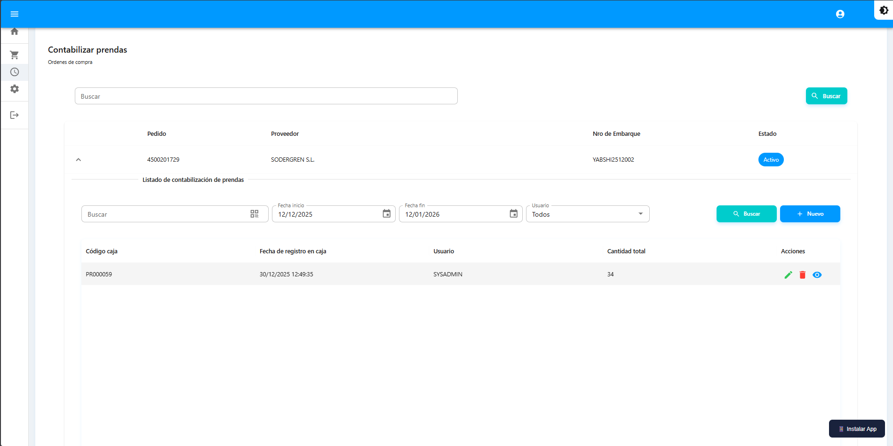
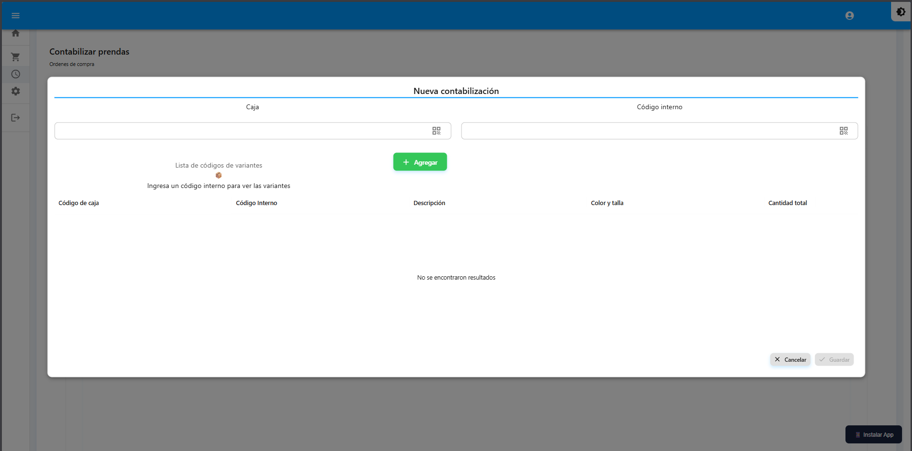

# Contabilizar Prendas

Control de inventario de prendas organizadas por cajas.


**Ruta:** Menú → Contabilizar prendas


***

## Listado de Órdenes

Muestra las órdenes de compra disponibles para contabilización.

<figure><figcaption></figcaption></figure>

| Columna | Descripción |
|---------|-------------|
| Pedido | Número de pedido |
| Nro de Embarque | Identificador |
| Proveedor | Nombre del proveedor |
| Estado | Estado de la orden |
| Acciones | Contabilizar |

***

## Buscar Orden

1. Use el campo de búsqueda en la parte superior
2. Escriba número de pedido, embarque o proveedor
3. La tabla se filtrará automáticamente

***

## Realizar Contabilización

1. Localice la orden deseada
2. Haga clic en **"Contabilizar"**
3. Complete el formulario de contabilización:

<figure><figcaption></figcaption></figure>

| Campo | Descripción |
|-------|-------------|
| Caja | Código de la caja física |
| Código interno | Código del producto |
| Lista de variantes | Códigos escaneados |

4. Escanee o ingrese los códigos de las prendas
5. Verifique el resumen

| Dato | Descripción |
|------|-------------|
| Código de caja | Identificador de la caja |
| Código interno | Código del producto |
| Descripción | Nombre del artículo |
| Color y talla | Variante del producto |
| Cantidad | Total de prendas |

6. Haga clic en **"Guardar"**


El sistema actualizará automáticamente el inventario al guardar.


***

## Verificar Contabilización

Una vez guardada la contabilización:

1. El sistema actualiza el inventario automáticamente
2. Puede consultar los totales por caja
3. Los datos quedan disponibles para reportes
