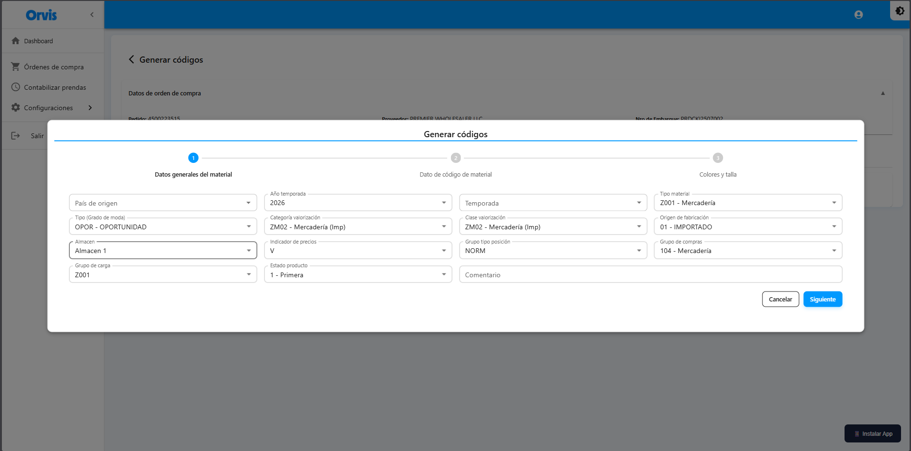
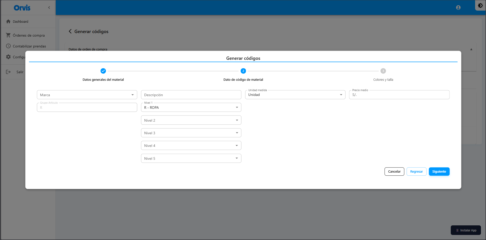
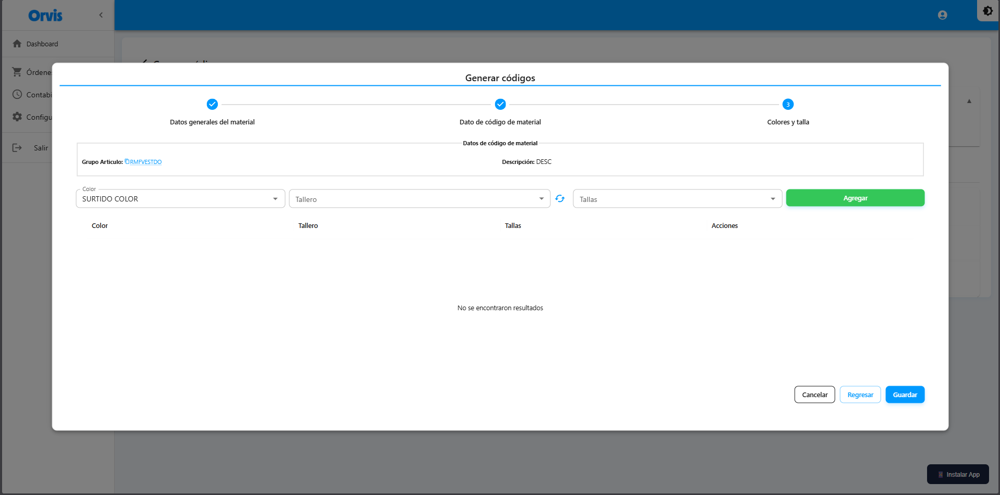
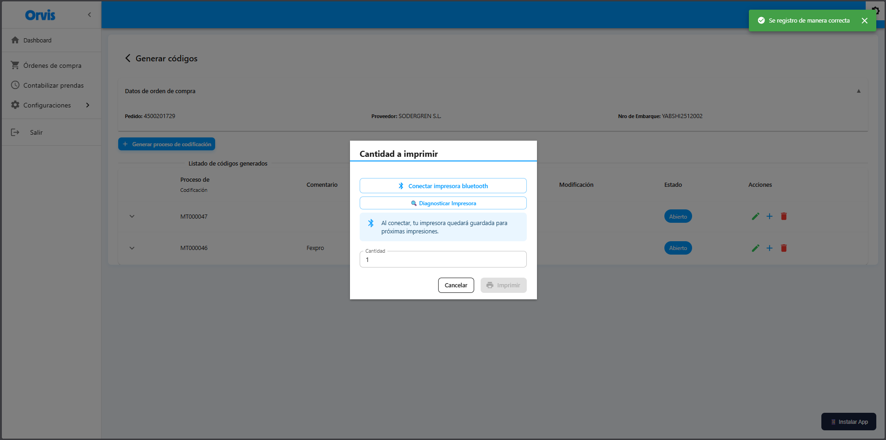

# Generar Códigos

Módulo principal para crear códigos de materiales con sus variantes por color y talla, vinculado a órdenes de compra.


**Acceso:** Desde el detalle de cada Orden de Compra (ícono 👁️ en columna Acciones)


<!-- -->

## Pantalla Principal

Al ingresar al detalle de una orden verá la pantalla de generación de códigos.


### Información de la Orden de Compra

En la parte superior se muestra un panel expandible con los datos de la orden seleccionada:

| Campo | Descripción |
|-------|-------------|
| Pedido | Número de orden de SAP |
| Proveedor | Nombre del proveedor |
| Nro de Embarque | Identificador del embarque |

### Tabla de Procesos de Codificación

Muestra todos los procesos de codificación creados para la orden:

| Columna | Descripción |
|---------|-------------|
| Proceso de Codificación | Código del proceso (ej: MT000046) |
| Comentario | Observaciones del proceso |
| Creación | Usuario y fecha de creación |
| Modificación | Usuario y fecha de modificación |
| Estado | Abierto / Cerrado |
| Acciones | Editar datos generales, Agregar variantes, Eliminar proceso |

### Botones de Acción Principal

| Botón | Función |
|-------|---------|
| **+ Generar proceso de codificación** | Crea un nuevo proceso si no existe ninguno, o permite agregar más códigos internos al proceso existente |
| **< Generar códigos** | Regresa al listado de órdenes de compra |

## Proceso de Codificación - Crear Nuevo

### Flujo de Creación

El proceso se divide en **3 pasos secuenciales** mediante un wizard:
1. **Datos Generales** - Información base del material
2. **Código de Material** - Configuración del producto específico
3. **Colores y Tallas** - Generación de variantes


Cada paso debe completarse antes de avanzar al siguiente. Los datos se guardan al finalizar cada paso.


<!-- -->

### PASO 1: Datos Generales del Material

Este paso configura la información base que aplica a todos los productos del proceso.




**Comportamiento según el contexto:**
- **Primer proceso:** Si es el primer proceso de codificación para la orden, todos los campos están habilitados para edición.
- **Procesos adicionales:** Si ya existe al menos un proceso, los campos se muestran en modo vista (solo lectura), utilizando los datos generales del proceso existente.


<!-- -->

#### Campos del Formulario

| Campo | Descripción | Tipo |
|-------|-------------|------|
| **País de origen** | País de fabricación del producto | Selector (obligatorio) |
| **Año temporada** | Año de la temporada | Selector (obligatorio, por defecto año actual) |
| **Temporada** | Temporada del producto | Selector (obligatorio, por defecto valor predeterminado) |
| **Tipo material** | Clasificación del material | Selector (obligatorio, por defecto valor predeterminado) |
| **Tipo grado de moda** | Nivel de moda del producto | Selector (obligatorio, por defecto valor predeterminado) |
| **Categoría valorización** | Categoría contable | Selector (obligatorio, por defecto valor predeterminado) |
| **Clase valorización** | Clase contable | Selector (obligatorio, por defecto valor predeterminado) |
| **Origen de fabricación** | Nacional/Importado/etc. | Selector (obligatorio, por defecto valor predeterminado) |
| **Bodega** | Bodega de almacenamiento | Selector (obligatorio, por defecto valor predeterminado) |
| **Indicador de precio** | Indicador de precio | Selector (obligatorio, por defecto valor predeterminado) |
| **Tipo grupo de posición** | Grupo de posición | Selector (obligatorio, por defecto valor predeterminado) |
| **Grupo de compras** | Grupo de compras | Selector (obligatorio, por defecto valor predeterminado) |
| **Grupo de carga** | Grupo de carga | Selector (obligatorio, por defecto valor predeterminado) |
| **Estado del producto** | Primera o Segunda calidad | Selector (obligatorio, por defecto "1 - Primera") |
| **Comentario** | Observaciones adicionales | Texto libre (opcional) |


Muchos campos tienen valores predeterminados configurados en los catálogos maestros, facilitando el registro rápido.


<!-- -->

#### Acciones del Paso 1

| Botón | Función |
|-------|---------|
| **Cancelar** | Cierra el wizard sin guardar cambios |
| **Siguiente** | Valida los campos y avanza al Paso 2. Guarda los datos generales |

**Comportamiento:**
- Si es un proceso nuevo: Crea el registro de proceso de codificación (Material)
- Si es un proceso existente al que se agregan códigos: Actualiza los datos generales si se modificaron
- Al completar exitosamente, el paso 1 queda marcado como completado en el stepper

### PASO 2: Código de Material (Datos del Producto)

En este paso se definen los detalles específicos del producto a crear.



#### Campos del Formulario

| Campo | Descripción | Tipo | Características |
|-------|-------------|------|-----------------|
| **Marca** | Marca del producto | Autocomplete (obligatorio) | Búsqueda por descripción |
| **Descripción** | Descripción del producto | Texto (obligatorio) | Se convierte automáticamente a MAYÚSCULAS, máx 40 caracteres |
| **Unidad de medida** | Unidad del producto (UN, PAR, etc.) | Selector (obligatorio) | Por defecto valor predeterminado |
| **Precio promedio** | Precio base del producto | Numérico (obligatorio) | Formato decimal, mín 0 |
| **Nivel 1** | Categoría principal | Selector (obligatorio) | Por defecto "R" |
| **Nivel 2** | Subcategoría | Selector (obligatorio) | Filtrado por Nivel 1 seleccionado |
| **Nivel 3** | División | Selector (obligatorio) | Filtrado por Nivel 2 seleccionado |
| **Nivel 4** | Línea | Autocomplete con búsqueda (obligatorio) | Búsqueda dinámica, mínimo 3 caracteres |
| **Nivel 5** | Sublínea | Autocomplete con búsqueda (obligatorio) | Búsqueda dinámica, mínimo 3 caracteres, filtrado por Nivel 4 |

#### Lógica de Niveles

Los niveles forman una jerarquía de 5 niveles que construyen el código del grupo de artículo:

**Filtrado Dinámico:**
- **Nivel 2** se filtra automáticamente según el Nivel 1 seleccionado
- **Nivel 3** se filtra automáticamente según el Nivel 2 seleccionado
- **Nivel 4** requiere búsqueda: escriba al menos 3 caracteres para buscar
- **Nivel 5** requiere búsqueda: escriba al menos 3 caracteres, filtrado por el Nivel 4 seleccionado

**Ejemplo de jerarquía:**
```
R → RZ → RZC → RZCACC → RZCACCCAM
```
<!-- -->


El código completo del grupo de artículo (Nivel 5) es esencial para vincular el tallero predeterminado en el siguiente paso.


<!-- -->

#### Acciones del Paso 2

| Botón | Función |
|-------|---------|
| **Regresar** | Vuelve al Paso 1 sin perder los datos ingresados |
| **Cancelar** | Cierra el wizard (los datos del Paso 1 ya están guardados) |
| **Siguiente** | Valida los campos, guarda el código de material y avanza al Paso 3 |

**Comportamiento:**
- Si ya existe un producto similar: Actualiza los datos existentes
- Si es nuevo: Crea el registro del producto (ProductId)
- Al completar exitosamente, el paso 2 queda marcado como completado en el stepper
- Los datos de marca y grupo de artículo se pasan al Paso 3 para prellenar información

### PASO 3: Colores y Tallas (Generación de Variantes)

Último paso donde se seleccionan los colores y tallas para generar todas las variantes del producto.



#### Información del Producto

En la parte superior se muestra la información del código de material creado:

| Campo | Descripción |
|-------|-------------|
| **Grupo de artículo** | Código completo del grupo (con ícono de copiar 📋) |
| **Descripción** | Descripción del producto ingresada en el Paso 2 |


Haga clic en el ícono de copiar junto al grupo de artículo para copiar el código al portapapeles.


<!-- -->

#### Campos de Selección

| Campo | Descripción | Tipo | Características |
|-------|-------------|------|-----------------|
| **Color** | Color del producto | Autocomplete (obligatorio) | Por defecto se selecciona el color marcado como predeterminado |
| **Tallero** | Conjunto de tallas | Selector (obligatorio) | Se autocarga el tallero vinculado al grupo de artículo (si existe). Muestra código y descripción |
| **Tallas** | Tallas específicas a generar | Multi-selección con checkboxes (obligatorio) | Se cargan automáticamente las tallas del tallero seleccionado. Permite seleccionar múltiples |

#### Flujo de Trabajo

**1. Selección Inicial**
- Al cargar, el sistema busca automáticamente el tallero asociado al grupo de artículo
- Si existe tallero predeterminado, lo carga junto con sus tallas
- Se preselecciona el color marcado como predeterminado en catálogos

**2. Agregar Variantes**
- Seleccione un color
- Seleccione o cambie el tallero si es necesario
- Marque las tallas deseadas (al menos una)
- Haga clic en **"Agregar"**

**3. Tabla de Variantes**
Muestra todas las combinaciones agregadas:

| Columna | Descripción |
|---------|-------------|
| Color | Descripción del color |
| Tallero | Descripción del tallero |
| Tallas | Lista de tallas seleccionadas (en chips) |
| Acciones | Eliminar fila (🗑️) |

**4. Agregar Más Variantes**
- Puede cambiar el color y agregar más variantes
- Si selecciona un color y tallero ya existente, las tallas nuevas se agregan a la fila existente
- Puede tener múltiples colores, cada uno con sus tallas


Si intenta agregar exactamente las mismas combinaciones de color, tallero y tallas, aparecerá un mensaje de error indicando que ya existe.


<!-- -->

#### Acciones del Paso 3

| Botón | Función |
|-------|---------|
| **Regresar** | Vuelve al Paso 2 manteniendo los datos de la tabla |
| **Agregar** | Agrega las variantes seleccionadas a la tabla |
| **Cancelar** | Cierra el wizard (los pasos anteriores ya están guardados) |
| **Generar** | Crea todas las variantes en el sistema y abre el modal de impresión |

**Validación antes de Generar:**
- Debe haber al menos una combinación en la tabla
- Todas las filas deben tener al menos una talla seleccionada

**Comportamiento al Generar:**
- El sistema crea un registro de variante por cada combinación: Color + Tallero + Talla individual
- Ejemplo: 2 colores × 5 tallas = 10 variantes creadas
- Al finalizar exitosamente, se cierra el wizard automáticamente
- Se muestra el modal de impresión de códigos de barras

## Modal de Impresión de Códigos de Barras

Después de generar las variantes, aparece automáticamente el modal de impresión.

### Opciones de Impresión

#### Impresión por Bluetooth

| Campo | Descripción |
|-------|-------------|
| **Número de copias** | Cantidad de etiquetas a imprimir por variante |
| **Impresora** | Selector de impresora Bluetooth configurada |

**Pasos:**
1. Ingrese el número de copias deseado
2. Seleccione la impresora Bluetooth de la lista
3. Haga clic en **"Imprimir"**
4. El sistema enviará los códigos a la impresora



**Después de Imprimir:**
- Al finalizar la impresión o presionar **"Cancelar"**, el sistema lo redirige automáticamente al **Paso 2** (Código de Material)
- Esto le permite agregar rápidamente más códigos internos al mismo proceso de codificación
- Puede repetir el proceso: Paso 2 → Paso 3 → Imprimir → Volver al Paso 2
- Si no desea agregar más códigos, cierre el wizard con el botón **"Cancelar"** del Paso 2


Debe tener configurada previamente la impresora Bluetooth. Ver [Impresora Bluetooth](../adicional/impresora-bluetooth.md).


<!-- -->

## Gestión de Procesos de Codificación

### Ver Detalle de un Proceso

1. En la tabla de procesos, haga clic en la flecha **˅** (expandir)
2. Se desplegará la lista de códigos internos (productos) del proceso

### Tabla de Códigos Internos (Expandida)

Muestra todos los productos creados dentro del proceso. La tabla incluye las siguientes columnas:

| Columna | Descripción |
|---------|-------------|
| **Código SAP** | Código SAP del material (vacío antes de sincronizar) |
| **Código Comercial SAP** | Código comercial asignado por SAP (vacío antes de sincronizar) |
| **Descripción SAP** | Comentario o descripción SAP del código (vacío antes de sincronizar) |
| **Grupo Artículo** | Código del grupo de artículo (5 niveles, ej: RMFVESTDO) |
| **Código Interno** | Código del producto interno del sistema (ej: PR000066) |
| **Descripción** | Descripción del producto |
| **Cant. Variantes** | Cantidad total de variantes (color + talla) generadas para este código |
| **Fecha creación** | Fecha y hora de creación del código |
| **Estado SAP** | Sin procesar / Procesado (con tooltip mostrando comentarios de error si existen) |
| **Acciones** | Imprimir, Editar código, Gestionar variantes, Eliminar, Ver variantes |

#### Barra de Herramientas

Encima de la tabla se encuentran:
- **Campo de búsqueda** con ícono de escaneo QR/código de barras
- **Botón Buscar**: Filtra los códigos internos
- **Botón Actualizar** (🔄): Refresca la lista y estados
- **Botón Sincronizar con SAP**: Se habilita al seleccionar códigos con checkboxes

### Operaciones Disponibles

#### Imprimir Códigos del Producto

1. Haga clic en el ícono **Imprimir** (🖨️) del código interno
2. Se abrirá el modal de impresión con todas las variantes del producto
3. Configure las opciones (Bluetooth o PDF)
4. Imprima todas las variantes del código


Esta opción imprime todas las variantes del código interno seleccionado de una sola vez.


<!-- -->

#### Editar Código Interno

1. Haga clic en el ícono **Editar** (✏️) del código interno
2. Se abrirá un modal con el formulario de edición (Paso 2)
3. Modifique los campos necesarios (Marca, Descripción, Precio, Grupo de artículo, Unidad de medida)
4. Haga clic en **"Guardar cambios"**
5. El sistema actualizará la información y refrescará la tabla



**Restricciones:**

- Solo se pueden editar códigos con estado "Sin procesar"
- Debe tener al menos una variante creada (`quantityVariants > 0`)
- No se puede editar si ya está "Procesado" en SAP


<!-- -->

#### Gestionar Variantes del Código (Eliminar Variantes)

1. Haga clic en el ícono **Gestionar variantes** (🗑️ rojo con escoba) del código interno
2. Se abrirá un modal mostrando todas las variantes del código
3. Puede eliminar variantes individuales desde la tabla de variantes
4. Use el botón **Cerrar** cuando termine


**Restricciones:**
- Solo disponible para códigos con estado "Sin procesar"
- Debe tener al menos una variante creada (`quantityVariants > 0`)
- Las variantes "Procesado" en SAP no pueden eliminarse


<!-- -->

**Uso típico:**
- Eliminar variantes incorrectas antes de sincronizar con SAP
- Corregir errores en colores o tallas seleccionadas
- Limpiar variantes de prueba

#### Eliminar Código Interno Completo

1. Haga clic en el ícono **Eliminar** (🗑️) del código interno
2. Aparecerá un mensaje de confirmación
3. Haga clic en **"Sí"** para confirmar
4. El código y todas sus variantes se eliminarán permanentemente


**Restricción crítica:** Solo se pueden eliminar códigos con estado "Sin procesar". Esta acción eliminará el código interno y TODAS sus variantes asociadas. Esta operación no se puede deshacer.


<!-- -->

#### Ver/Expandir Variantes

1. Haga clic en el ícono **Ver** (👁️) o en la flecha **˅** del código interno
2. Se desplegará la tabla de variantes individuales (color + talla)

#### Editar Datos Generales del Proceso

1. Haga clic en el ícono **Editar** (✏️) en la fila principal del proceso
2. Se abrirá un modal con los datos generales del Paso 1
3. Modifique los campos necesarios
4. Haga clic en **"Actualizar"**


Solo se pueden editar los datos generales (Paso 1). Los productos individuales se editan desde su propia acción.


<!-- -->

#### Agregar Más Productos al Proceso

1. Haga clic en el ícono **Agregar** (+) en la fila principal del proceso
2. Se abrirá el wizard de codificación
3. El Paso 1 se omite (usa los datos generales del proceso existente)
4. Comienza directamente en el Paso 2 (Código de Material)
5. Complete los pasos 2 y 3 normalmente

**Comportamiento:**
- Los nuevos productos se agregarán al mismo proceso de codificación
- Compartirán los mismos datos generales (país, temporada, tipo material, etc.)
- Cada producto puede tener sus propias variantes

#### Eliminar Proceso de Codificación

1. Haga clic en el ícono **Eliminar** (🗑️) en la fila principal del proceso
2. Confirme la acción en el mensaje emergente
3. Se eliminará todo el proceso y sus productos asociados


Esta acción eliminará permanentemente el proceso y todos sus productos. Solo es posible si no tiene productos sincronizados con SAP.


<!-- -->

## Ver y Gestionar Variantes

### Expandir Variantes del Código Interno

Para ver las variantes individuales de un código interno:

1. Primero, expanda el **Proceso de Codificación** haciendo clic en la flecha **˅**
2. Se mostrará la tabla de **Códigos Internos** (productos del proceso)
3. En la fila del código interno deseado, haga clic en el ícono **Ver** (👁️) en la columna Acciones
4. Se desplegará la tabla de variantes (combinaciones de color + talla) de ese código específico


Las variantes NO se muestran al expandir el proceso. Primero debe expandir el proceso para ver los códigos internos, y luego hacer clic en el ícono Ver (👁️) de un código interno para ver sus variantes.


<!-- -->

### Tabla de Variantes (Detalle)

Muestra todas las combinaciones individuales de color y talla para el código interno seleccionado:

**Campos de información del código (parte superior del modal):**
- **Código Interno**: Código del producto (deshabilitado)
- **Descripción**: Descripción del producto (deshabilitado)

**Columnas de la tabla:**

| Columna | Descripción |
|---------|-------------|
| **Código SAP** | Código único asignado por SAP después de sincronizar (vacío si está "Sin procesar") |
| **Código Interno** | Código interno de la variante específica |
| **Color** | Descripción del color de la variante |
| **Talla** | Talla específica mostrada en un chip |
| **Acciones** | Eliminar variante (solo visible si el código está en modo edición) |


Cada fila representa una variante única. Por ejemplo: si tiene 2 colores y 5 tallas, verá 10 filas (2 × 5 = 10 variantes).


<!-- -->

### Operaciones con Variantes

#### Imprimir Códigos de Barras

**Método: Imprimir Todas las Variantes del Código**
1. En la tabla de códigos internos, haga clic en el ícono **Imprimir** (🖨️) del código
2. Se abrirá el modal de impresión de códigos de barras
3. Configure las opciones:
   - **Número de copias**: Cantidad de etiquetas por variante
   - **Impresora**: Seleccione la impresora Bluetooth configurada
4. Haga clic en **"Imprimir"**
5. El sistema imprimirá todas las variantes del código


Esta opción imprime todas las variantes del código interno de una sola vez. Solo está disponible si el código tiene al menos una variante (`quantityVariants > 0`).


<!-- -->


Después de imprimir exitosamente por Bluetooth, el sistema muestra un mensaje de confirmación, cierra el modal y actualiza automáticamente la tabla.


<!-- -->

#### Eliminar Variante Individual

**Desde el modal de Gestionar Variantes:**
1. Abra el modal de variantes haciendo clic en el ícono **Gestionar variantes** (🗑️ con escoba)
2. En la tabla de variantes, haga clic en el ícono **Eliminar** (🗑️) de la variante específica
3. Aparecerá un mensaje de confirmación
4. Haga clic en **"Sí"** para confirmar la eliminación
5. La variante se eliminará permanentemente


**Restricciones importantes:**
- La columna de Acciones solo es visible si abrió el modal en "modo edición" (`isEdit: true`)
- Solo se pueden eliminar variantes de códigos con estado "Sin procesar"
- Las variantes de códigos "Procesado" (sincronizados con SAP) no pueden eliminarse
- Esta acción es irreversible


<!-- -->

## Sincronización con SAP

La sincronización envía los códigos generados al sistema SAP para su registro oficial.

### Sincronizar Códigos Internos

**Sincronización Individual:**
1. Expanda el proceso de codificación (˅)
2. Seleccione el checkbox del código interno deseado
3. Haga clic en **"Sincronizar con SAP"** en la barra superior
4. Confirme la acción

**Sincronización Múltiple:**
1. Expanda el proceso de codificación (˅)
2. Seleccione los checkboxes de múltiples códigos internos
3. Haga clic en **"Sincronizar con SAP"**
4. Confirme la acción

### Proceso de Sincronización

1. El sistema envía los datos a SAP
2. SAP procesa y valida la información
3. Si es exitoso, SAP asigna códigos oficiales
4. El estado cambia de "Sin procesar" a "Procesado"
5. Aparecen los códigos SAP en las variantes


La sincronización puede tardar varios minutos dependiendo de la cantidad de variantes. El proceso se ejecuta en segundo plano.


<!-- -->

### Actualizar Estado de Sincronización

Después de sincronizar, para ver los cambios:
1. Haga clic en el botón **"Actualizar"** (🔄) en la barra superior
2. O cierre y vuelva a abrir el proceso de codificación
3. Los códigos SAP y estados actualizados se mostrarán

### Estados de SAP

| Estado | Descripción |
|--------|-------------|
| **Sin procesar** | El código no ha sido enviado a SAP, o está pendiente de procesamiento |
| **Procesado** | El código fue exitosamente registrado en SAP y tiene código SAP asignado |


Una vez que un código está "Procesado" en SAP, no se puede eliminar ni modificar desde el sistema. Cualquier cambio debe hacerse directamente en SAP.


<!-- -->

## Búsqueda y Filtros

### Búsqueda en Lista de Procesos

**Campos de búsqueda:**
- **Filtro general**: Busca por código de proceso, comentario o descripción
- **Fechas**: Filtra por rango de fechas de creación
- **Estado**: Filtra por estado (Abierto/Cerrado)

**Pasos:**
1. Ingrese el texto en el campo de búsqueda
2. Ajuste las fechas si es necesario
3. Seleccione el estado (opcional)
4. Haga clic en **"Buscar"**

### Búsqueda en Códigos Internos

Dentro de un proceso expandido:
1. Use el campo de búsqueda superior
2. Escriba código interno o descripción
3. La tabla se filtrará automáticamente

## Características Especiales

### Valores Predeterminados

El sistema utiliza valores predeterminados configurados en los catálogos maestros para agilizar el registro:
- Temporada actual
- Tipo de material
- Tipo grado de moda
- Categorías y clases de valorización
- Origen de fabricación
- Bodega
- Indicadores
- Grupos

### Validaciones Automáticas

**En Paso 1:**
- Todos los campos obligatorios deben completarse
- Los selectores muestran solo opciones activas

**En Paso 2:**
- La descripción se convierte automáticamente a mayúsculas
- Los niveles se filtran en cascada
- El precio debe ser mayor o igual a 0
- La búsqueda de niveles 4 y 5 requiere mínimo 3 caracteres

**En Paso 3:**
- Debe seleccionar al menos un color y una talla
- No permite duplicar exactamente la misma combinación
- Valida que el tallero tenga tallas disponibles

### Autocompletado Inteligente

**Grupo de Artículo:**
- El Nivel 1 por defecto es "R"
- Los niveles 2 y 3 se filtran automáticamente
- Los niveles 4 y 5 tienen búsqueda dinámica con debounce
- Al seleccionar un nivel, se actualiza automáticamente el código completo

**Tallero:**
- Se carga automáticamente el tallero asociado al grupo de artículo
- Las tallas del tallero se cargan dinámicamente
- Si no hay tallero asociado, muestra todos los disponibles

### Gestión de Estado

**Estados del Proceso:**
- **Abierto (1)**: El proceso puede ser modificado y se pueden agregar productos
- **Cerrado (2)**: El proceso está finalizado, no permite modificaciones

**Estados SAP:**
- **Sin procesar**: No sincronizado, permite editar y eliminar
- **Procesado**: Sincronizado con SAP, no permite eliminar
