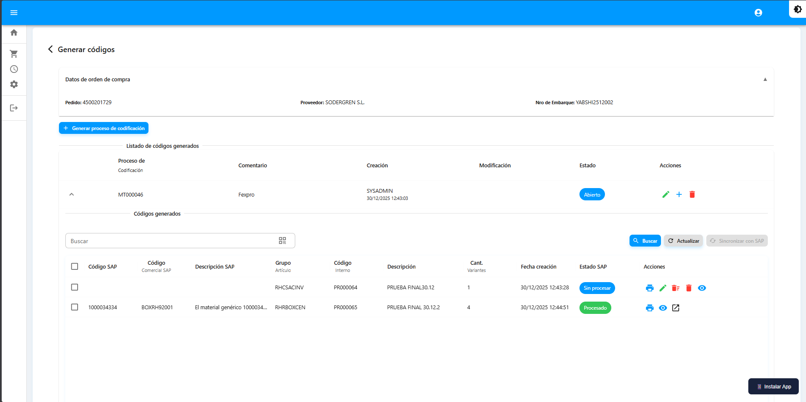

# Generar Códigos

Módulo principal para crear códigos de materiales con sus variantes por color y talla.


**Acceso:** Desde el detalle de cada Orden de Compra (ícono →)


***

## Pantalla Principal

Al ingresar al detalle de una orden verá la pantalla de generación de códigos.

<figure><figcaption></figcaption></figure>

**Cabecera:** Muestra los datos de la orden seleccionada:
* Pedido
* Proveedor  
* Nro de Embarque

**Tabla de códigos generados:**

| Columna | Descripción |
|---------|-------------|
| Proceso de Codificación | Código (ej: MT000046) |
| Comentario | Observaciones |
| Creación | Usuario y fecha |
| Estado | Abierto / Cerrado |
| Acciones | Editar, Agregar, Eliminar |

***

## Crear Proceso de Codificación

1. Haga clic en **"+ Generar proceso de codificación"**

**Paso 1 - Datos Generales**

Complete los campos del formulario:

| Campo | Descripción |
|-------|-------------|
| País de origen | País de fabricación |
| Año temporada | Año correspondiente |
| Temporada | Primavera/Verano/Otoño/Invierno |
| Tipo material | Clasificación del material |
| Tipo grado de moda | Nivel de moda |
| Categoría y Clase | Categorías de valorización |
| Origen de fabricación | Nacional/Importado |
| Marca | Marca del producto |
| Descripción | Descripción del artículo |
| Unidad de medida | Unidad (UN, KG, etc.) |

Haga clic en **"Siguiente"**

**Paso 2 - Niveles**

Seleccione los niveles del grupo de artículo:

| Nivel | Descripción |
|-------|-------------|
| Nivel 1 | Categoría principal |
| Nivel 2 | Subcategoría |
| Nivel 3 | División |
| Nivel 4 | Subdivisión |
| Nivel 5 | Detalle específico |

Haga clic en **"Siguiente"**

**Paso 3 - Variaciones**

<figure><figcaption></figcaption></figure>

1. Seleccione los **Colores** del producto
2. Seleccione el **Tallero** (conjunto de tallas)
3. Marque las **Tallas** específicas
4. Haga clic en **"Generar"**


Debe seleccionar al menos un color y una talla para generar las variantes.


***

## Ver Variantes

1. Haga clic en el ícono **˅** (expandir) junto al código
2. Se desplegará la lista de variantes con:
   * Código SAP
   * Código Interno
   * Descripción
   * Color y Talla
   * Estado SAP

***

## Imprimir Códigos de Barras

1. Expanda las variantes (˅)
2. Seleccione las variantes a imprimir (casillas)
3. Haga clic en **"Imprimir"** (🖨️)
4. Ingrese la cantidad de etiquetas
5. Seleccione la impresora Bluetooth
6. Confirme la impresión


Debe configurar previamente la impresora Bluetooth. Ver sección [Impresora Bluetooth](../adicional/impresora-bluetooth.md).


***

## Sincronizar con SAP

1. Seleccione los códigos a sincronizar
2. Haga clic en **"Sincronizar con SAP"**
3. Confirme la acción
4. Espere el mensaje de confirmación
5. Use **"Actualizar"** para ver los cambios


El proceso de sincronización se ejecuta en segundo plano y puede tomar varios minutos.


***

## Regresar

Haga clic en **"< Generar códigos"** en la parte superior para volver al listado de órdenes.
