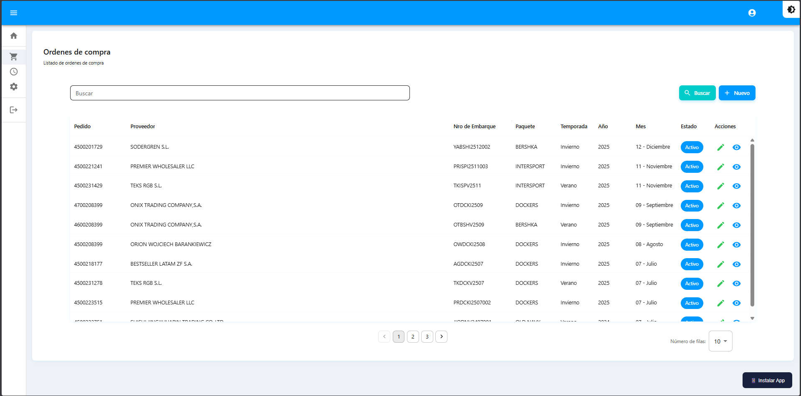
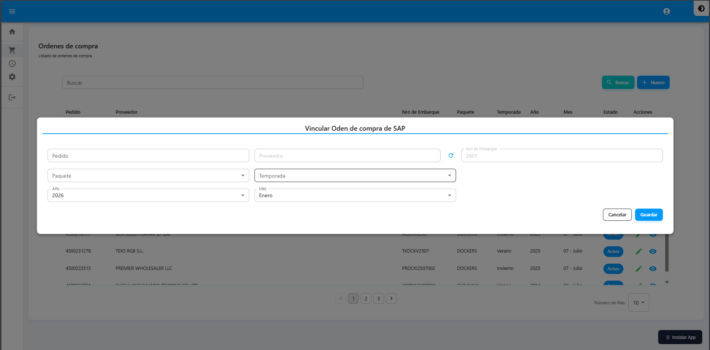

# Órdenes de Compra

Gestión de pedidos vinculados con SAP y acceso a la generación de códigos.


**Ruta:** Menú → Órdenes de compra


## Listado de Órdenes

Al acceder verá la tabla con todas las órdenes de compra registradas.

<figure><figcaption></figcaption></figure>

| Columna | Descripción |
|---------|-------------|
| Pedido | Número de pedido SAP |
| Nro de Embarque | Identificador del embarque |
| Paquete | Tipo de paquete |
| Temporada | Temporada del producto |
| Proveedor | Nombre del proveedor |
| Estado | Abierto / Cerrado |
| Acciones | Editar, Detalle, Eliminar |

## Buscar Órdenes

1. Localice el campo de búsqueda en la parte superior
2. Escriba el número de pedido, embarque o proveedor
3. La tabla se filtrará automáticamente

## Crear Nueva Orden

1. Haga clic en el botón **"Nuevo"**
2. Complete el formulario "Vincular Orden de compra de SAP"

<figure><figcaption></figcaption></figure>

| Campo | Descripción |
|-------|-------------|
| Número de pedido | Código del pedido en SAP |
| Número de embarque | Identificador único del embarque |
| Proveedor | Seleccionar de la lista |
| Paquete | Tipo de empaque |
| Temporada | Temporada del producto |

3. Haga clic en **"Guardar"**


Todos los campos marcados con asterisco (*) son obligatorios.


## Editar Orden

1. Localice la orden en la tabla
2. Haga clic en el ícono **Editar** (✏️)
3. Modifique los datos necesarios
4. Haga clic en **"Actualizar"**

## Eliminar Orden

1. Haga clic en el ícono **Eliminar** (🗑️)
2. Confirme la eliminación en el mensaje emergente


Esta acción no se puede deshacer. Asegúrese antes de eliminar.


## Acceder a Generar Códigos


La generación de códigos se realiza **desde dentro** de cada orden de compra.


1. Localice la orden de compra deseada
2. Haga clic en el ícono de **Detalle** (→)
3. Accederá a la pantalla "Generar códigos" de esa orden
